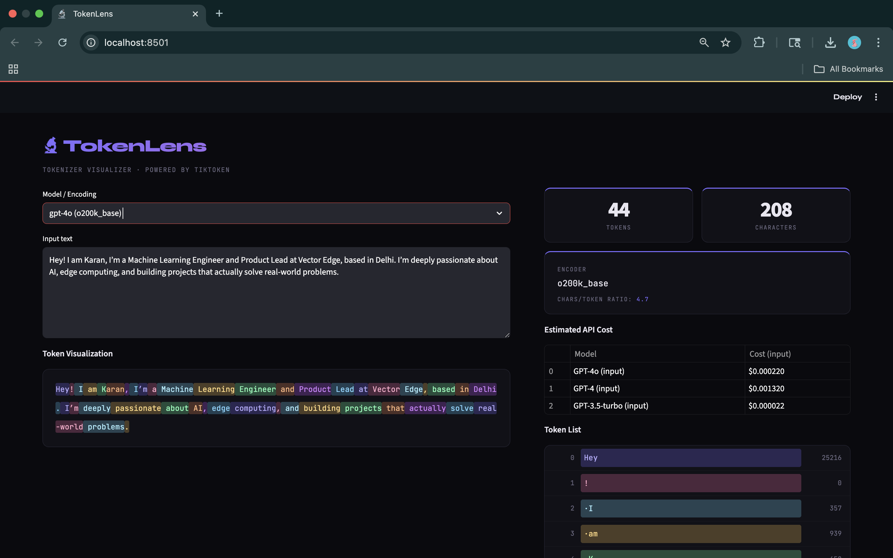

# 🔬 TokenLens

> Visualize how AI models tokenize your text — instantly, in your browser.

---

https://github.com/user-attachments/assets/946f0e4e-910a-4bbd-acff-07a3ce4007ae

---

## What is TokenLens?

Language models don't read text the way humans do. They break it into **tokens** — chunks of characters that may be words, parts of words, punctuation, or even spaces.

TokenLens lets you see exactly how that happens, so you can:

- Understand why your prompt costs what it does
- Debug unexpected model behavior caused by weird tokenization
- Learn how different models split the same text differently

---

## Demo



---

## Features

-  Color-coded token visualization — each token gets a distinct color
-  Token list with index and token ID
-  Token count, character count, and chars-per-token ratio
-  Estimated API cost for GPT-4o, GPT-4, and GPT-3.5
-  Switch between 4 encoders in real time
-  Updates instantly as you type

---

## Supported Encodings

| Encoding | Models | Vocab Size |
|---|---|---|
| `cl100k_base` | GPT-4, GPT-3.5-turbo | 100,277 |
| `o200k_base` | GPT-4o | 200,019 |
| `p50k_base` | text-davinci-002/003 | 50,281 |
| `r50k_base` | GPT-2, GPT-3 | 50,257 |

---

## Installation

### Prerequisites

Make sure you have Python installed. You can check by running:

```bash
python --version
```

You need **Python 3.8 or higher**. If you don't have it, download it from [python.org](https://www.python.org/downloads/).

---

### Step 1 — Clone the repo

```bash
git clone https://github.com/your-username/TokenLens.git
cd TokenLens
```

---

### Step 2 — Create a virtual environment (recommended)

```bash
# Mac / Linux
python -m venv venv
source venv/bin/activate

# Windows
python -m venv venv
venv\Scripts\activate
```

> A virtual environment keeps your project dependencies isolated from the rest of your system. Good practice.

---

### Step 3 — Install dependencies

```bash
pip install -r requirements.txt
```

Or install manually:

```bash
pip install streamlit tiktoken
```

---

### Step 4 — Run the app

```bash
streamlit run app.py
```

Then open your browser and go to:

```
http://localhost:8501
```

---

## Dependencies

| Package | Version | Purpose |
|---|---|---|
| `streamlit` | >= 1.28 | Web UI framework |
| `tiktoken` | >= 0.5 | OpenAI's tokenizer |

Create a `requirements.txt` with:

```
streamlit>=1.28
tiktoken>=0.5
```

---

## API Cost Reference

Prices are per **1 million input tokens** as of early 2025:

| Model | Input |
|---|---|
| GPT-4o | $5.00 |
| GPT-4 | $30.00 |
| GPT-3.5-turbo | $0.50 |

> Always check [OpenAI's pricing page](https://openai.com/pricing) for the latest rates.

---

## Key Concepts

**What is a token?**
A token is a chunk of text — roughly 4 characters or ¾ of a word on average in English. Numbers, punctuation, and rare words often get split into multiple tokens.

**What is BPE?**
Byte Pair Encoding — the algorithm tiktoken uses. It starts with individual bytes and repeatedly merges the most common pairs until it builds a vocabulary of ~100k tokens.

**Why does tokenization matter?**
- API costs are calculated per token, not per word or character
- Context windows (e.g. 128k tokens) are measured in tokens
- Unusual tokenization can cause models to misread numbers, code, or names

---

## Project Structure

```
TokenLens/
├── app.py            ← Streamlit web app
├── requirements.txt  ← Python dependencies
└── README.md
```

---

## License

MIT — do whatever you want with it.

---

*Built to learn. Inspired by [tiktokenizer.vercel.app](https://tiktokenizer.vercel.app)*
